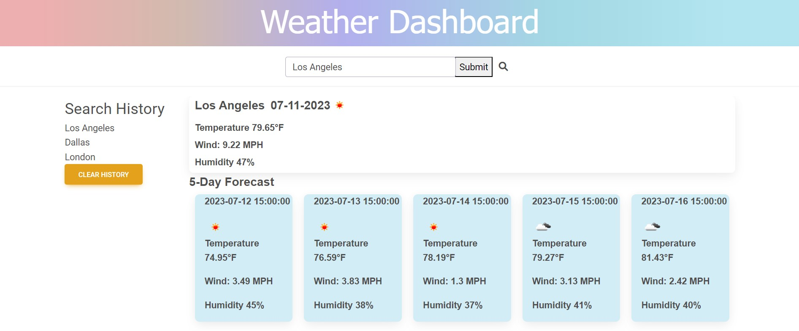

# Weather Dashboard

## Description

This weather dashboard utilizes a third-party API to provide current and upcoming weather conditions for the next 5 days for any city provided in the search bar. The user is presented with weather conditions like temperature, wind speed, humidity, and an icon illustrating the current weather conditions at a glance. The search history is saved to local storage and displayed for the user to see.

## Usage

Users are greeted with a search bar from which they can enter a city of their choice. The respective weather conditions for the current time and upcoming 5 day forecast are retrieved through the OpenWeather API and displayed on the page. To search for a new city, users can simply repeat the process. Their search history is saved to local storage and can be cleared with a button at the bottom of the list.

Link to the deployed website itself:

https://kevrev.github.io/weather-dashboard/

One can also view the index.html, script.js, and style.css files independently in the GitHub repository:

https://github.com/Kevrev/weather-dashboard

## Technology Used

[MDBootstrap](https://mdbootstrap.com/)

[jQuery](https://jquery.com/)

[day.js](https://day.js.org/)

[OpenWeather API](https://openweathermap.org/api)

[OpenWeather GeoCoding API](https://openweathermap.org/api/geocoding-api)

[OpenWeather current weather API](https://openweathermap.org/current)

[OpenWeather forecast API](https://openweathermap.org/forecast5)

## Credits

Credit to the OpenWeather team for the API, but also their thorough documentation and examples that make it easy to use and parse.